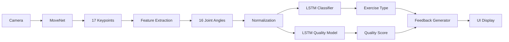

# 🏥 RehabAI - AI-Powered Physical Therapy Platform

[](https://www.python.org/)
[](https://www.tensorflow.org/)
[](https://flask.palletsprojects.com/)
[](LICENSE)

> **Complete ML Pipeline with LSTM-based Exercise Classification & Real-time Form Correction**

RehabAI is an intelligent physical therapy platform that uses advanced computer vision and deep learning to provide real-time feedback on exercise form. The system helps patients perform rehabilitation exercises correctly and safely from home.


---

## 🌟 **Key Features**

### **🤖 AI-Powered Analysis**
- **MoveNet Pose Detection**: Real-time tracking of 17 body keypoints
- **LSTM Neural Network**: Time-series classification for exercise recognition
- **Quality Grading Model**: ML-based form evaluation and scoring
- **Multi-Exercise Support**: Squat, Shoulder Press, Lunge, Lateral Raise

### **📊 Real-Time Feedback**
- **Live Form Correction**: Instant feedback on exercise technique
- **Rep Counting**: Automatic repetition detection with quality validation
- **Progress Tracking**: Visual progress bars and quality metrics
- **State Machine Logic**: Intelligent movement phase detection

### **💻 Full-Stack Architecture**
- **Client-Side**: TensorFlow.js for lightweight on-device pose estimation
- **Server-Side**: Flask + TensorFlow/Keras for heavy ML processing
- **RESTful API**: Clean separation between frontend and backend
- **Real-Time Processing**: 10fps frame analysis with LSTM evaluation

---

## 🏗️ **System Architecture**

```
┌─────────────────────────────────────────────────────────────┐
│                    CLIENT (Web Browser)                      │
├─────────────────────────────────────────────────────────────┤
│  1. Webcam Capture (WebRTC)                                  │
│  2. MoveNet Pose Detection (TensorFlow.js)                   │
│  3. Skeleton Visualization (HTML5 Canvas)                    │
│  4. Keypoint Transmission (10fps → Backend)                  │
└────────────────────────┬────────────────────────────────────┘
                         │ REST API (HTTP/JSON)
                         ↓
┌─────────────────────────────────────────────────────────────┐
│                    SERVER (Python/Flask)                     │
├─────────────────────────────────────────────────────────────┤
│  1. Feature Extraction (16 Joint Angles)                     │
│  2. Normalization (Position/Scale Invariant)                 │
│  3. LSTM Classification (Exercise Recognition)               │
│  4. LSTM Quality Grading (Form Evaluation)                   │
│  5. Feedback Generation (Real-time Coaching)                 │
└─────────────────────────────────────────────────────────────┘
```

### **Data Flow Pipeline**



---

## 📋 **Technical Specifications**

### **Frontend Stack**
| Technology | Version | Purpose |
|------------|---------|---------|
| TensorFlow.js | 4.11.0 | Client-side ML inference |
| MoveNet | SINGLEPOSE_LIGHTNING | Pose detection model |
| HTML5 Canvas | - | Skeleton rendering |
| WebRTC | - | Camera access |
| Tailwind CSS | 3.x | UI styling |

### **Backend Stack**
| Technology | Version | Purpose |
|------------|---------|---------|
| Python | 3.8+ | Core language |
| Flask | 3.0.0 | Web framework |
| TensorFlow/Keras | 2.15.0 | LSTM models |
| NumPy | 1.24.3 | Numerical computing |

### **ML Model Architecture**

#### **1. Exercise Classifier (LSTM)**
```python
Input: (30 frames, 16 angles) - 1 second of movement
├── Masking Layer (handle variable length)
├── LSTM(128) + Dropout(0.2)
├── LSTM(64) + Dropout(0.2)
├── Dense(64, relu) + Dropout(0.3)
└── Dense(4, softmax) → [Squat, Shoulder Press, Lunge, Lateral Raise]
```

#### **2. Quality Assessment (LSTM per Exercise)**
```python
Input: (30 frames, 16 angles)
├── Masking Layer
├── LSTM(64) + Dropout(0.2)
├── LSTM(32) + Dropout(0.2)
├── Dense(32, relu) + Dropout(0.2)
└── Dense(1, sigmoid) → Quality Score [0-1]
```

### **Feature Extraction**
16 joint angles calculated from normalized keypoints:
1. Left/Right Knee Angle
2. Left/Right Hip Angle
3. Left/Right Elbow Angle
4. Left/Right Shoulder Angle
5. Left/Right Trunk Angle
6. Left/Right Upper Back Angle
7. Left/Right Lower Trunk Angle
8. Left/Right Arm Extension

---

## 🚀 **Installation & Setup**

### **Prerequisites**
- Python 3.8 or higher
- Modern web browser (Chrome/Edge recommended)
- Webcam
- 4GB+ RAM

### **Step 1: Clone Repository**
```bash
git clone https://github.com/yourusername/RehabAI.git
cd RehabAI
```

### **Step 2: Backend Setup**
```bash
cd backend

# Create virtual environment
python -m venv venv

# Activate virtual environment
# Windows:
venv\Scripts\activate
# Mac/Linux:
source venv/bin/activate

# Install dependencies
pip install -r requirements.txt
```

### **Step 3: Start Backend Server**
```bash
python app.py
```

You should see:
```
============================================================
🏥 RehabAI Backend Server Starting...
============================================================
✓ ML Models Loaded
✓ 4 Exercises Available: squat, shoulder_press, lunge, lateral_raise
✓ Server running on http://localhost:5000
============================================================
```

### **Step 4: Start Frontend**

Open a new terminal:

```bash
cd frontend

# Option 1: Use Python's built-in server
python -m http.server 8000

# Option 2: Use Node.js http-server (if installed)
npx http-server -p 8000
```

### **Step 5: Access Application**

Open your browser and navigate to:
```
http://localhost:8000
```

**Important**: Make sure the backend is running on port 5000!

---

## 📖 **Usage Guide**

### **1. Select Exercise**
- Choose from 4 available exercises on the home screen
- Each exercise shows target muscle groups and rep count

### **2. Start Session**
- Click "Start Exercise" button
- Allow camera access when prompted
- Stand 6-8 feet from camera with full body visible

### **3. Perform Exercise**
- Follow on-screen feedback for form correction
- System automatically counts valid reps
- Quality score updates in real-time

### **4. Complete Session**
- Click "Stop" when finished
- View session summary and stats
- Progress saved to Dashboard

### **Exercise Tips**
- **Lighting**: Ensure good lighting for better detection
- **Background**: Plain background works best
- **Distance**: Stand far enough to show full body
- **Speed**: Perform exercises at moderate pace

---

## 💪 **Available Exercises**

### **1. Squat**
- **Target**: Quadriceps, Glutes, Hamstrings
- **Reps**: 10
- **Key Points**:
  - Feet shoulder-width apart
  - Knees aligned with toes
  - Squat to parallel or below
  - Keep back straight

### **2. Shoulder Press**
- **Target**: Deltoids, Triceps, Upper Back
- **Reps**: 12
- **Key Points**:
  - Start with arms at 90°
  - Press overhead to full extension
  - Keep core tight
  - Control the descent

### **3. Lunge**
- **Target**: Quadriceps, Glutes, Calves
- **Reps**: 10 (each leg)
- **Key Points**:
  - Step forward with control
  - Front knee at 90°
  - Back knee hovers above ground
  - Keep torso upright

### **4. Lateral Raise**
- **Target**: Lateral Deltoids, Upper Traps
- **Reps**: 15
- **Key Points**:
  - Arms slightly bent
  - Raise to shoulder height
  - Control both up and down
  - Avoid swinging

---

## 🔧 **API Documentation**

### **Endpoints**

#### **GET /api/exercises**
Get list of available exercises
```json
{
  "success": true,
  "exercises": {
    "squat": {
      "name": "Squat",
      "description": "Lower body strength exercise",
      "target_reps": 10,
      "muscle_groups": ["Quadriceps", "Glutes", "Hamstrings"]
    }
  }
}
```

#### **POST /api/session/start**
Start a new exercise session
```json
// Request
{
  "exercise_type": "squat"
}

// Response
{
  "success": true,
  "session_id": "session_1234567890",
  "exercise": { ... }
}
```

#### **POST /api/session/{session_id}/frame**
Process a frame of keypoints
```json
// Request
{
  "keypoints": [
    {"x": 100, "y": 200, "score": 0.9, "name": "nose"},
    ...
  ]
}

// Response
{
  "success": true,
  "exercise_detected": "squat",
  "confidence": 0.98,
  "quality_score": 0.85,
  "feedback": [
    {"message": "Good form!", "type": "positive"}
  ],
  "angles": [160, 158, ...],
  "state": "down"
}
```

#### **POST /api/session/{session_id}/rep**
Count a completed repetition
```json
// Request
{
  "quality_score": 0.85
}

// Response
{
  "success": true,
  "rep_count": 5,
  "quality_score": 0.85,
  "average_quality": 0.83
}
```

#### **POST /api/session/{session_id}/end**
End exercise session
```json
{
  "success": true,
  "summary": {
    "session_id": "session_1234567890",
    "total_reps": 10,
    "average_quality": 0.85,
    "duration": 180
  }
}
```

---

## 🧪 **Testing**

### **Backend Tests**
```bash
cd backend
python -m pytest tests/
```

### **Frontend Tests**
Open browser console and run:
```javascript
// Test pose detection
console.log('Detector loaded:', detector !== null);

// Test session
console.log('Current session:', sessionId);
```

---

## 🎯 **Future Enhancements**

### **Phase 2: Advanced Features**
- [ ] 3D Pose Estimation (MediaPipe BlazePose)
- [ ] Multi-person detection
- [ ] Video recording and playback
- [ ] Personalized workout plans
- [ ] Therapist dashboard

### **Phase 3: Mobile Apps**
- [ ] React Native mobile app
- [ ] Offline mode with local models
- [ ] Apple Watch / Fitbit integration
- [ ] Social features and challenges

### **Phase 4: Enterprise**
- [ ] Multi-tenant architecture
- [ ] HIPAA compliance
- [ ] EMR integration
- [ ] Insurance billing support
- [ ] Telehealth video calls

---

## 🤝 **Contributing**

We welcome contributions! Please see [CONTRIBUTING.md](CONTRIBUTING.md) for guidelines.

### **Development Setup**
```bash
# Fork and clone
git clone https://github.com/yourusername/RehabAI.git

# Create feature branch
git checkout -b feature/amazing-feature

# Make changes and commit
git commit -m "Add amazing feature"

# Push and create PR
git push origin feature/amazing-feature
```

---

## 📄 **License**

This project is licensed under the MIT License - see [LICENSE](LICENSE) file for details.

---

## 👥 **Team & Credits**

### **Core Team**
- **AI/ML Engineer**: LSTM model design & training
- **Computer Vision**: Pose detection pipeline
- **Backend Developer**: Flask API & data processing
- **Frontend Developer**: UI/UX & TensorFlow.js integration

### **Technologies**
- [TensorFlow](https://www.tensorflow.org/) - ML framework
- [MoveNet](https://www.tensorflow.org/hub/tutorials/movenet) - Pose detection
- [Flask](https://flask.palletsprojects.com/) - Web framework
- [Tailwind CSS](https://tailwindcss.com/) - UI styling

---

## 📞 **Support**

- **Documentation**: [docs.rehabai.com](https://docs.rehabai.com)
- **Issues**: [GitHub Issues](https://github.com/yourusername/RehabAI/issues)
- **Email**: support@rehabai.com
- **Discord**: [Join our community](https://discord.gg/rehabai)

---

## 🎉 **Acknowledgments**

Special thanks to:
- Google Research for MoveNet
- TensorFlow team for excellent documentation
- Physical therapy professionals who provided domain expertise
- Beta testers who provided valuable feedback

---

<div align="center">
  <p>Made with ❤️ for better rehabilitation outcomes</p>
  <p>⭐ Star us on GitHub if you find this helpful!</p>
</div>
